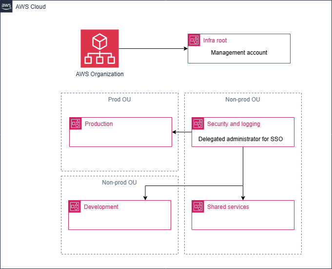
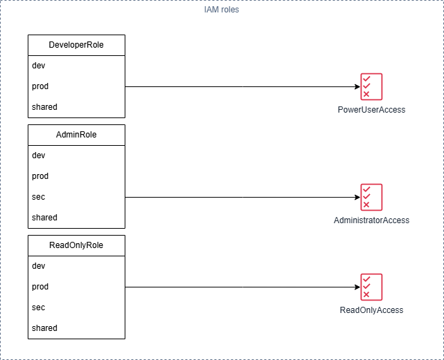

# AWS Organization Setup with Terraform

This repo contains an example Terraform code how to set up your AWS organization, its units, roles and permissions in them.

## Organization setup

In this example organization, there is a root account which also is the management account for the whole organization. The organization itself is divided into three organizational units (OU-s) - non-prod, prod and other.

Besides the root account, the organizations consists of the following AWS accounts:

* Development
* Production
* Security and logging
* Shared services

It is a good practice to separate each environment and functional team/product.

### Service control policies (SCP)

Service Control Policies are to enforce access policies at the organizational unit (OU) or account level. In this example, I have created a SCP that denies terminating EC2 instances and deleting S3 buckets in non-prod OU.

### Delegated administrator

As the root account has all the possible permissions, it is important to make it secure and avoid direct access to it. Since root account is responsible for SSO and user access on the organization level, another AWS account has been made as delegated administrator for that. This approach ensures centralized access management and security while avoiding direct interaction with root account. In this example, security and logging account has been made as delegated administrator for SSO service.

## IAM roles

For the initial setup, IAM roles for each AWS account are also created. Usually, there are three different roles defined - developer, admin and read-only. Each of the roles has its permission set defined.

The permission sets for the roles are following:

* Developer - PowerUserAccess
* Admin - AdministratorAccess
* Read-only - ReadOnlyAccess

All of the accounts except security and logging account have the three roles existing. Security and logging account doesn't have the developer role.

Each role has the account identifier as a prefix to segregate which account the role belongs to.